

# Mon train va-t-il être en retard ?

*"De toute façon, les trains à la SNCF ne sont jamais à l'heure..."*

Qu'en est-il vraiment ? 

Pourrions-nous prédire le retard d'un train, avant même qu'il ne soit parti ?

## Contexte

Pour répondre à cette question, les [données de ponctualité fournies par la SNCF](https://data.sncf.com/explore/?sort=modified&q=r%C3%A9gularit%C3%A9&refine.keyword=R%C3%A9gularit%C3%A9) posent deux problèmes : 

1. La granularité mensuelle est trop large : on ne peut pas identifier de motifs journaliers, horaires, ou encore l'impact de la météo, d'évènements ponctuels, etc.

2. La définition du retard utilisée par la SNCF masque une partie de la réalité : 

| Durée du parcours | Seuil de retard pour être considéré à l'heure |
|-------------------|-----------------------------------------------|
| < 1h30            | < 5 minutes                                   |
| 1h30 - 3h         | < 10 minutes                                  |
| > 3h              | < 15 minutes                                  |

Ainsi, un train ayant 9 minutes de retard sur un trajet de 1h30 ne sera pas comptabilisé.
 
### Objectifs

Afin d'approfondir les statistiques officielles de la SNCF, et mieux comprendre les retards des trains, nous allons nous appuyer sur un jeu de données exhaustif, listant l'intégralité des circulations de trains (TAGV, TER, Intercités, RER), arrêts par arrêt, à la seconde près, entre 2017 et 2024. Ce jeu de données est fourni par l'[ART](https://www.autorite-transports.fr/observatoire-et-numerique/jeux-de-donnees-en-open-data/), Autorité de Régulation des Transports.

Notre objectif sera d'étudier les facteurs de retard, identifier des motifs récurrents, en vue de prédire le retard d'un train.

### Périmètre d'étude

Considérant la taille du jeu de données (144Go), nous allons restreindre le périmètre de notre étude à :
- la partition "SLO" du jeu de données, regroupant les lignes à grande vitesse (notamment les TGV Inoui, Ouigo, Thalys, Eurostar, Renfe, Trenitalia...)
- uniquement le départ et l'arrive de chaque train, sans les arrêts intermédiaires
- de 2019 à 2024

# Structure du projet

Le dépôt Github du projet est structuré de la façon suivante :

- `data/1-raw` : données brutes, non modifiées, format CSV (voir détail `data/1-raw/readme.md`)
- `data/2-clean` : données après ingestion et nettoyage, format Parquet
- `notebooks` : Jupyter Notebooks utilisés pour l'ingestion et l'analyse des données
- `scripts` : script d'ingestion de la circulation
- `powerbi` : fichier .pbix du tableau Power BI
- `models` : modèles prédictifs
- `assets` : contient les images et graphiques utilisées dans ce readme
- `environment.yml` : fichier de configuration de l'environnement Conda

# Diagramme d'architecture des données

Les données utilisées dans ce projet suivent le flux suivant :

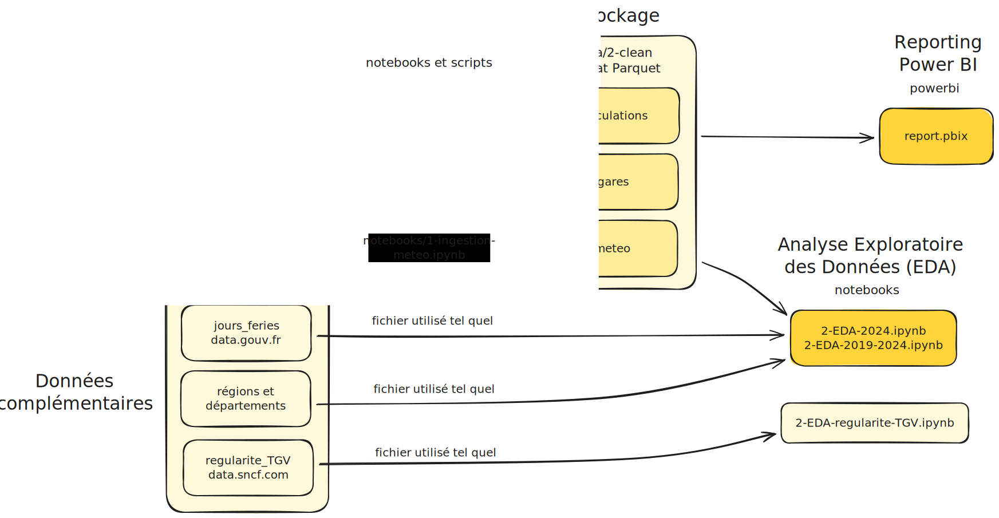

# Analyse Exploratoire de Données (EDA)

Après avoir ingéré et nettoyés les données brutes, nous obtenons un jeu de données de 1.367.207 circulations de trains entre 2019 et 2024. Nous allons pouvoir les analyser selon plusieurs axes : temporel, spatial, météorologique.

## Analyse temporelle

À l'échelle mensuelle, on constate que les grands pics de retards sont souvent liés à des évènements majeurs. Certains sont peu prévisibles (grèves, attaques du réseau), d'autres le sont partiellement (intempéries, canicules).

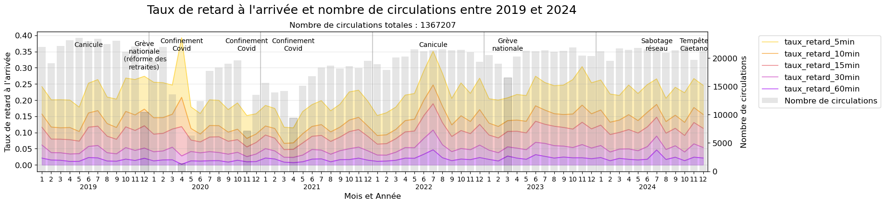

À l'échelle journalière, on constate que :
- les trains du vendredi sont plus souvent sujets au retards
- les trains du samedi et dimanche sont les plus ponctuels

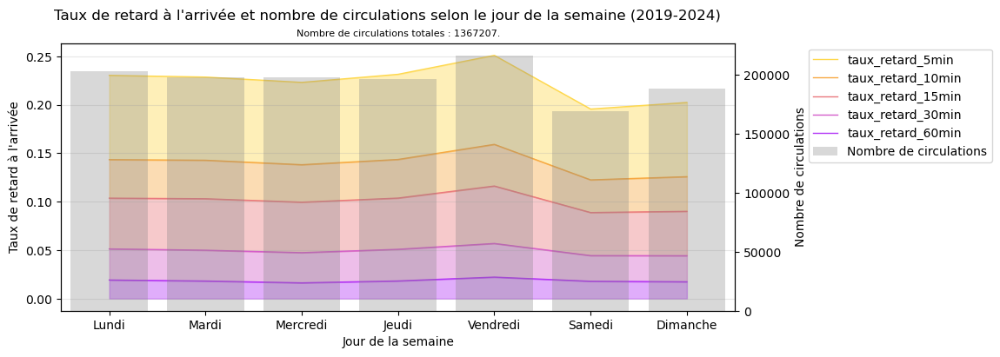

À l'échelle horaire, on constate que :
- les trains du matin (6-9h) sont plus ponctuels que ceux de l'après-midi (16-20h)

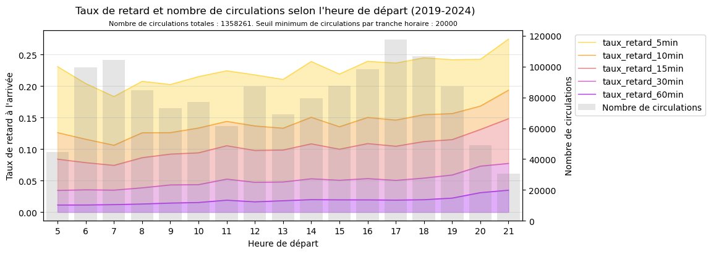

Pour plus de détail, on peut également s'intéresser à l'interaction entre le jour de la semaine et l'heure de la journée :
- le vendredi soir semble effectivement être la période la plus sujette aux retards (jusqu'à 30% de retard à 5 minutes)
- à l'opposé du samedi et dimanche matin, qui affichent moins de 20% de retard à 5 minutes

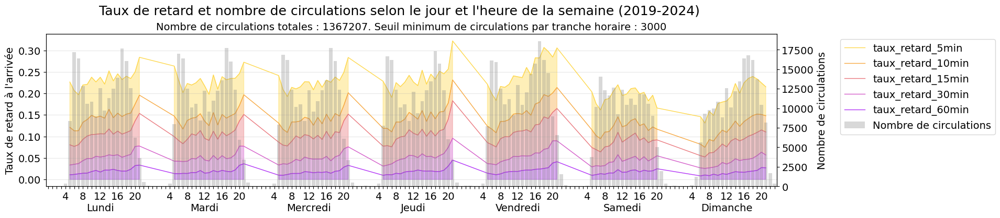

## Analyse spatiale

La longueur du trajet semble également avoir un impact notable : les trajets de moins de 500km sont généralement plus ponctuels (20% de retard à 5 minutes) que les trajets plus de 500km (entre 25 et 30% de retard à 5 minutes). 

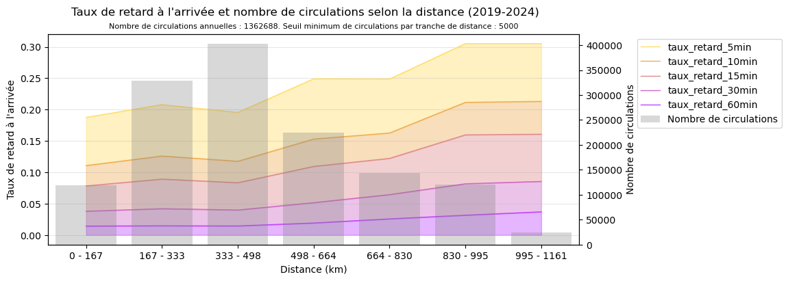

Certaines régions de France semblent plus promptes aux retards, notamment Provence-Alpes-Côte d'Azur et Occitanie.

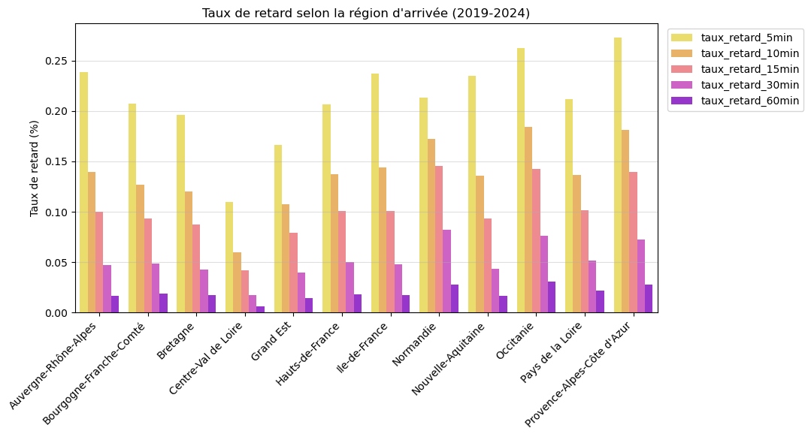

## Analyse météorologique

Pour cette analyse, un modèle simplifié a été utilisé, en considérant les paramètres météorologiques journaliers à l'échelle de la région d'arrivée uniquement. Étant donné les effets important du Covid sur le traffic ferroviaire, l'analyse météorologique se concentrera sur les années 2022-2024.

Comme on peut le constater sur les graphiques suivants, le taux de retard augmente :
- lors de fortes chaleurs (>35°C) et de vagues de froid (température maximale entre 0 et 5°C)
- lors de fortes précipitations (>15mm sur la journée)
- lors de vents violents (rafales >80km/h)

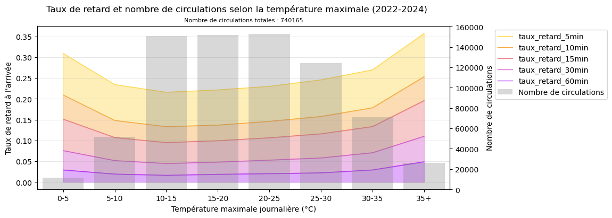

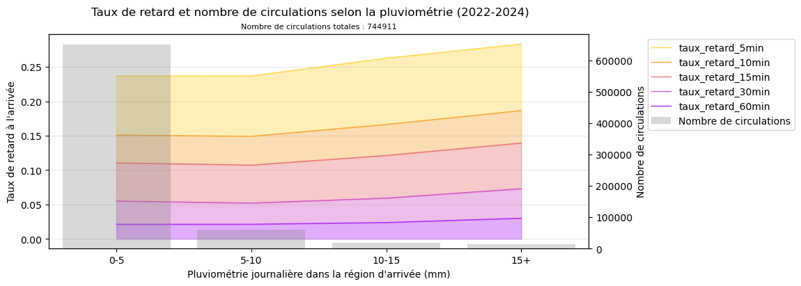

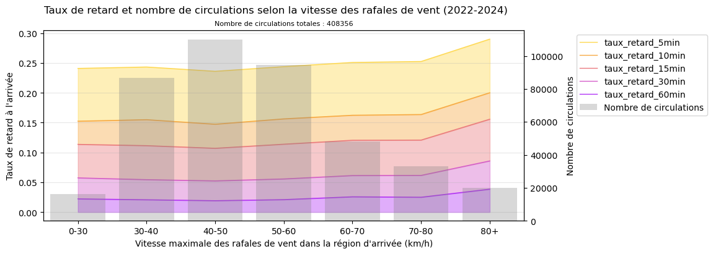

# Rapport interactif Power BI

Un rapport interactif a alors été réalisé sur Power BI, permettant de filtrer visuellement par année, compagnie ferroviaire, gare de départ et d'arrivée, région, mois, jour et heure. En voici un aperçu :

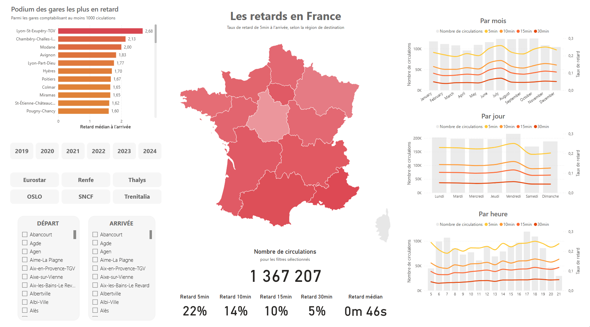

# Modèle prédictif

En s'appuyant notre analyse exploratoire des données, il paraît tout à fait réaliste de construire un modèle prédictif estimant la probabilité qu'un train soit à l'heure ou non. 

En nous inspirant du travail réalisé par l'ART à ce sujet, sur leur simulateur [Previseo](https://previseo.autorite-transports.fr/), nous pourrions réaliser un modèle d'apprentissage par arbre de décision, utilisant des paramètres tels que le jour de la semaine, l'heure du trajet, l'axe ferroviaire, ou encore la période de l'année, la distance totale, la région, la ligne considérée, les gares de départ et d'arrivée. Enfin, nouveauté par rapport à leur travail, nous pourrions envisager d'intégrer des données météorologiques (pluie, vent, température).

Les variables catégorielles (ex : jour, ligne) seront codées en variables numériques via un encodage adéquat (one-hot ou target encoding), et les données météo agrégées par région journalière.

Cette partie du projet n'a pas encore été réalisée à ce jour (03/12/2025), mais le sera bientôt.

# Recommandations pratiques

Si toutefois vous deviez absolument éviter les retards, voici quelques conseils pratiques :
- partir le matin plutôt (6-9h) que le soir (16-20h).
- éviter le vendredi, privilégier le samedi ou le dimanche.
- éviter les journées de fortes pluies (>15mm), de vent violent (rafales>80km/h), de vagues de froid (<5°C), et de canicules (>35°C).
- privilégier les trajets courts (<500km).
- éviter certaines régions plus sujettes aux retards (ex : Provence-Alpes-Côte d'Azur, Occitanie).
- rester chez soi (100% d'efficacité garantie).

# Prochaines étapes du projet

- Finaliser le modèle prédictif
- Considérer l'ensemble des arrêts intermédiaires, plutôt que le départ et l'arrivée uniquement. Certaines régions semblent sous-représentées dans les statistiques, potentiellement car les trains n'y font que passer (le terminus pouvant se trouver dans une autre région)
- Analyser l'ensemble des données de circulation : TER, Intercités, RER... Considérant la taille des fichiers (jusqu'à 10Go par CSV), l'extraction avec Pandas ne semble par réaliste, même en chargeant les fichiers par blocs (chunks). Il faudrait envisager une solution basée sur Spark ou Dask, utilisant du calcul distribué.
- Analyse météorologique plus fine : actuellement agrégé par jour et par région, on pourrait considérer des mesures horaires et localisées (par gare, par exemple).

# Lexique

- **TAGV** : nom générique des Trains à Grande Vitesse (le "TGV" étant une marque déposée de la SNCF).
- **taux_retard_xmin** : taux de retard à l'arrivée supérieur à x minutes.
- **circulation** : représente un train unique, à une date précise, pour un trajet donné (une marche).
- le **nombre de circulations** comptabilise ainsi l'ensemble des trains ayant circulé sur une période donnée.
- **ART** : Autorité de Régulation des Transports, organisme indépendant chargé de veiller au bon fonctionnement des transports en France.
- **SNCF** : Société Nationale des Chemins de fer Français, principale entreprise ferroviaire en France.

# Utilisation du dépôt

- cloner le dépôt
- installer les dépendances : `conda env create -f environment.yml`
- télécharger les données brutes non synchronisées sur Github, dont les sources sont mentionnées dans le fichier `data/1-raw/readme.md`