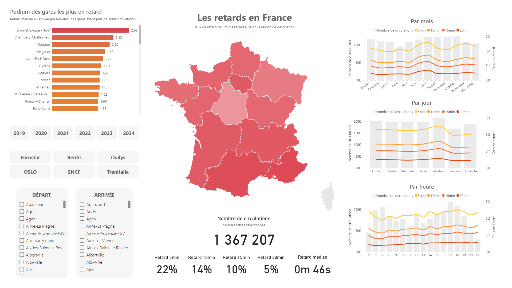

# Mon train va-t-il être en retard ?

## Contexte

## Analyse Exploratoire de Données (EDA)

Recherche de patterns (motifs) 

Retards selon le jour et l'heure de départ

Analyse historique & grands évènements

## Power BI

## Modèle prédictif

todo

## Recommandations

Pour éviter les retards : 
- partir le matin plutôt que le soir
- éviter le vendredi soir, privilégier le samedi ou le dimanche
- ne pas aller à Lyon et dans le Sud-Est en général (c'était prévu ? dommage)
- rester chez soi

## Usage

- cloner le repo
- installer les dépendances : `conda env create -f environment.yml`
- télécharger les données depuis https://ftp.autorite-transports.fr/circulations_ferroviaires.zip dans data/1-raw, et extraire l'ensemble des .zip